# Country Website

A web application that displays information about countries with a backend API and frontend interface.

## Project Structure

```
country-website/
├── backend/
│   ├── package.json
│   └── server.js
├── frontend/
│   ├── index.html
│   ├── script.js
│   └── style.css
├── .github/
│   └── workflows/
│       └── deploy.yml
├── .gitignore
└── README.md
```

## Backend

The backend is a Node.js server that provides API endpoints for country data.

### Requirements
- Node.js (v14 or higher)
- npm

### Installation

```bash
cd backend
npm install
```

### Running the Server

```bash
cd backend
npm start
# or
node server.js
```

The server will start and listen on the configured port (default: 3000).

### Dependencies
- `wikipedia` - For fetching country information from Wikipedia

## Frontend

The frontend is a vanilla JavaScript web application that displays country information.

### Files
- `index.html` - Main HTML structure
- `script.js` - JavaScript logic for fetching and displaying data
- `style.css` - Styling

### Running

Simply open `frontend/index.html` in your web browser or serve it using a local server:

```bash
# Using Python
python -m http.server 8000

# Or using Node.js http-server
npx http-server
```

## Getting Started

1. **Clone the repository**
   ```bash
   git clone <repository-url>
   cd country-website
   ```

2. **Start the backend**
   ```bash
   cd backend
   npm install
   npm start
   ```

3. **Open the frontend**
   - Open `frontend/index.html` in your browser
   - Or serve the frontend folder on a local server

## API Endpoints

Check `backend/server.js` for available API endpoints and their usage.

## CI/CD Pipeline

This project uses **GitHub Actions** for continuous integration and deployment.

### Workflow Details

- **Workflow File**: `.github/workflows/deploy.yml`
- **Trigger**: Automatically runs on push events to the repository
- **Purpose**: Automates testing, building, and deployment processes

The CI/CD pipeline ensures code quality and enables seamless deployment of updates to your application.

### Project Workflow Diagram

```mermaid
graph LR
    Start([Developer Pushes Code]) -->|Git Commit| Repo["📦<br/>GitHub Repository"]
    
    Repo -->|Webhook Trigger| GA["⚙️ GitHub Actions<br/>Workflow Triggered"]
    
    GA -->|1| Checkout["📥 Checkout Code<br/>Pull Repository"]
    Checkout -->|2| NodeSetup["🔧 Setup Node.js<br/>v14+"]
    NodeSetup -->|3| BackendDeps["📚 Backend Setup<br/>npm install"]
    BackendDeps -->|4| BackendBuild["🏗️ Build Backend<br/>Validate & Test"]
    
    BackendBuild -->|5| FrontendDeps["📚 Frontend Setup<br/>Bundle Assets"]
    FrontendDeps -->|6| FrontendBuild["🎨 Build Frontend<br/>Optimize Files"]
    
    FrontendBuild -->|All Checks Passed| Quality["✅ Quality Gate<br/>Passed"]
    Quality -->|Approval| Deploy["🚀 Deploy to<br/>Production"]
    
    Deploy -->|Backend| ProdBackend["🖥️ Backend Server<br/>Node.js API Port 3000"]
    Deploy -->|Frontend| ProdFrontend["💻 Frontend Server<br/>Static Files"]
    
    ProdBackend -->|Fetch Data| Wiki["🌐 Wikipedia API<br/>Country Information"]
    ProdFrontend -->|API Calls| ProdBackend
    ProdFrontend -->|Display| Browser["👤 User Browser<br/>Display Countries"]
    
    Browser -.->|User Interaction| ProdFrontend
    
    style Start fill:#007AFF,stroke:#004C99,stroke-width:2px,color:#fff
    style Repo fill:#28A745,stroke:#1B6B2F,stroke-width:2px,color:#fff
    style GA fill:#FF6B35,stroke:#CC5528,stroke-width:2px,color:#fff
    style Checkout fill:#4A90E2,stroke:#2E5C8A,stroke-width:2px,color:#fff
    style NodeSetup fill:#4A90E2,stroke:#2E5C8A,stroke-width:2px,color:#fff
    style BackendDeps fill:#6C63FF,stroke:#4A3F99,stroke-width:2px,color:#fff
    style BackendBuild fill:#6C63FF,stroke:#4A3F99,stroke-width:2px,color:#fff
    style FrontendDeps fill:#F46B9D,stroke:#B84A6F,stroke-width:2px,color:#fff
    style FrontendBuild fill:#F46B9D,stroke:#B84A6F,stroke-width:2px,color:#fff
    style Quality fill:#00D084,stroke:#009B5C,stroke-width:2px,color:#fff
    style Deploy fill:#FF6B35,stroke:#CC5528,stroke-width:2px,color:#fff
    style ProdBackend fill:#9B59B6,stroke:#6C3F7C,stroke-width:2px,color:#fff
    style ProdFrontend fill:#E67E22,stroke:#A55A17,stroke-width:2px,color:#fff
    style Wiki fill:#1ABC9C,stroke:#0C7A6B,stroke-width:2px,color:#fff
    style Browser fill:#34495E,stroke:#1C2833,stroke-width:2px,color:#fff
```



#### Pipeline Stages

| Stage | Description |
|-------|-------------|
| **Code Push** | Developer commits and pushes changes to GitHub |
| **Workflow Trigger** | GitHub Actions automatically triggers on push event |
| **Code Checkout** | Clone repository in the runner environment |
| **Environment Setup** | Install Node.js and required runtime dependencies |
| **Backend Build** | Install dependencies and validate backend code |
| **Frontend Build** | Bundle and optimize frontend assets |
| **Quality Gate** | All tests and validation checks passed |
| **Deployment** | Deploy both backend and frontend to production |
| **Runtime** | Backend serves API, Frontend displays to users, Wikipedia data integration |

## Contributing

Feel free to submit issues and enhancement requests!

## License

This project is open source and available under the MIT License.
